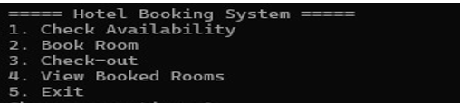
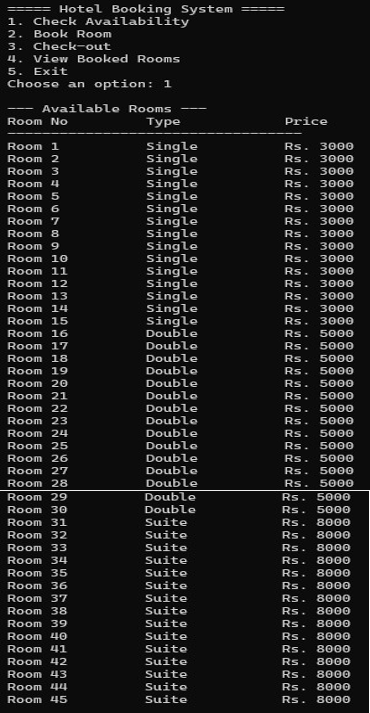

<div align="center">

# 🏨 HOTEL MANAGEMENT SYSTEM

### Efficient Room Booking & Hotel Management Solution in C++


<br><br>

*A Console-Based Hotel Room Booking System Developed Using C++ Programming Concepts Including Arrays, Functions, Loops, Conditional Statements, and Data Management Techniques.*

</div>

---

## 📖 Project Description

The **Hotel Management System** is a console-based application developed in **C++** to automate hotel room booking and management operations. The system efficiently handles room reservations, guest information, room availability tracking, billing calculations, and check-out procedures.

The application manages **45 hotel rooms** categorized into **Single**, **Double**, and **Suite** rooms. It provides hotel staff with a simple menu-driven interface to perform daily operations while ensuring data consistency and preventing duplicate bookings.

By implementing core programming concepts such as arrays, functions, loops, and conditional statements, this project demonstrates a practical real-world application of C++ programming in hotel management and reservation systems.

---

## 📋 Project Overview

This project was developed as part of the **Computer Fundamentals and Programming (CIS-101L)** course.

The Hotel Management System manages:

- Room Availability
- Room Booking
- Guest Information
- Check-Out Process
- Billing Calculation
- Booked Room Records

The program uses arrays and functions to organize room data and customer information.

---

# 📸 Project Screenshots

## Main Menu



---

## Room Availability



---

## Room Booking


---

## Check-Out & Billing


---

## Booked Rooms List


---

# 🎯 Objectives

The main objectives of this project are:

- Manage hotel rooms efficiently
- Store guest details
- Prevent double booking
- Calculate customer bills automatically
- Display booked and available rooms
- Provide a simple user-friendly interface

---

# 🏨 Hotel Room Configuration

The hotel contains a total of **45 rooms**.

| Room Type | Quantity |
|------------|-----------|
| Single Room | 15 |
| Double Room | 15 |
| Suite Room | 15 |
| Total Rooms | 45 |

---

# 💰 Room Pricing

| Room Type | Price Per Day |
|------------|--------------|
| Single Room | PKR 3,000 |
| Double Room | PKR 5,000 |
| Suite Room | PKR 8,000 |

---
# 📊 System Flowchart

The following flowchart illustrates the complete workflow of the Hotel Management System, including room initialization, booking operations, availability checking, check-out processing, and record management.

<p align="center">
  
</p>

The system begins by initializing all hotel rooms and then presents a menu-driven interface to the user. Based on the selected option, the system performs room availability checks, room booking, guest check-out with bill calculation, or displays booked room records. The process continues until the user chooses to exit the application.

# ⚙️ System Features

## 1️⃣ Check Availability

Displays:

- Room Number
- Room Type
- Room Price
- Availability Status

The user can view all vacant rooms before booking.

---

## 2️⃣ Book Room

Allows guests to reserve available rooms.

Information Collected:

- Guest Name
- CNIC Number
- Phone Number
- Number of Days

Validation Included:

✔ Room exists

✔ Room available

✔ Prevents double booking

---

## 3️⃣ Check-Out System

When a guest checks out:

- Room is released
- Bill is generated
- Service tax is added

### Billing Formula

Total Bill = (Room Price × Days Stayed)

Service Tax = 10%

Final Bill = Total Bill + Service Tax

Example:

Room Price = PKR 5000

Days Stayed = 3

Room Charges = 5000 × 3 = 15000

Service Tax = 1500

Final Bill = PKR 16500

---

## 4️⃣ View Booked Rooms

Displays:

- Room Number
- Guest Name
- CNIC
- Phone Number
- Room Type
- Days Stayed

Useful for hotel management and record keeping.

---

# 🏗 Program Structure

The project is divided into several functions:

## initializeRooms()

Initializes all rooms and marks them as available.

---

## checkAvailability()

Displays all available rooms.

---

## bookRoom()

Handles room reservations and customer data entry.

---

## checkOut()

Processes customer check-out and bill calculation.

---

## viewBooked()

Displays all occupied rooms and guest details.

---

## main()

Provides the menu-driven interface and calls all system functions.

---

# 🔄 Program Workflow

```text
Start Program
      │
      ▼
Initialize Rooms
      │
      ▼
Display Menu
      │
 ┌────┼────┐
 ▼    ▼    ▼
Check Book Checkout
Avail Room
      │
      ▼
View Booked Rooms
      │
      ▼
Exit
```

---

# 🛠 Technologies Used

- C++
- Arrays
- Functions
- Conditional Statements
- Loops
- Console Programming
- Object-Oriented Programming Concepts

---


# 📊 Key Features

✅ 45 Room Management

✅ Single, Double, Suite Rooms

✅ Guest Information Storage

✅ Room Availability Tracking

✅ Automatic Bill Calculation

✅ 10% Service Tax Calculation

✅ Check-In / Check-Out Management

✅ Booked Room Records

✅ Menu-Driven Interface

---

# 🔒 Input Validation

The system ensures:

- Valid room numbers
- Available room selection
- No duplicate booking
- Correct customer information entry

---

# 📈 Future Improvements

Potential enhancements include:

- File Handling for permanent records
- Database Integration (MySQL)
- Graphical User Interface (GUI)
- Online Booking System
- Admin Login Authentication
- Room Search Filters
- Receipt Generation in PDF

---

# 🎓 Academic Information

**Course:** Computer Fundamentals and Programming (CIS-101L)

**Department:** Electrical Engineering

**Project Type:** Semester Project

**Language:** C++

---

# 📜 Conclusion

The Hotel Management System is a simple yet effective C++ application designed to automate hotel room management operations. The project demonstrates the practical implementation of arrays, functions, loops, and conditional statements while providing useful hotel booking and billing functionality.

It successfully manages room reservations, customer records, room availability, check-out procedures, and bill generation through a clean and interactive menu-driven interface.

---

## 👨‍💻 Author

**Muhammad Sufyan**

Electrical Engineering Student
